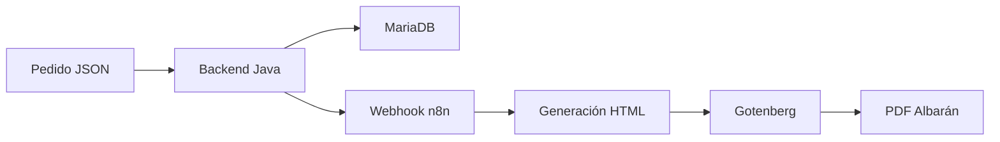

# Rasmia Logistics Automation

Solución de integración logística que automatiza la recepción de pedidos y la generación de albaranes PDF mediante backend Java, MariaDB, n8n y Docker.

---

## 🧩 Contexto y Problema

En entornos logísticos, la generación de albaranes y la gestión de pedidos suele implicar procesos manuales o herramientas desconectadas entre sí.

Esto genera:

- Retrasos en la generación documental
- Riesgo de errores humanos
- Falta de trazabilidad
- Dificultad para escalar el proceso

Este proyecto implementa una arquitectura de integración backend que automatiza el flujo completo desde la recepción del pedido hasta la generación automática del PDF del albarán.

---

## 🏗 Arquitectura

El sistema está diseñado con separación clara de responsabilidades:

- **Backend Java (Maven)** → Gestión del pedido y persistencia
- **MariaDB** → Almacenamiento relacional
- **n8n** → Orquestación del flujo de automatización
- **Gotenberg** → Generación de documentos PDF
- **Docker** → Contenerización y entorno reproducible

### Flujo técnico

1. Se recibe un pedido en formato JSON.
2. El backend valida y procesa la información.
3. Se persiste en MariaDB mediante patrón DAO.
4. Se dispara un webhook hacia n8n.
5. n8n genera dinámicamente el HTML del albarán.
6. Gotenberg transforma el HTML en PDF.
7. El PDF queda disponible para descarga o uso operativo.

Arquitectura orientada a desacoplar la lógica de negocio, la persistencia y la generación documental.

---

## 🧱 Stack Tecnológico

### Backend
- Java
- Maven
- Servlets / JSP
- DAO Pattern
- JDBC

### Base de datos
- MariaDB

### Automatización
- n8n
- Webhooks HTTP
- JSON

### Generación documental
- Gotenberg (HTML → PDF)

### Infraestructura
- Docker

---

## 🔄 Flujo Funcional

Pedido  
→ Backend  
→ Base de datos  
→ Webhook  
→ n8n  
→ HTML dinámico  
→ Gotenberg  
→ PDF generado  

---

## 🎯 Decisiones Técnicas

- **DAO Pattern** para desacoplar acceso a datos de la lógica de negocio.
- **Webhooks** para separar backend y capa de automatización.
- **Generación PDF desacoplada** mediante microservicio (Gotenberg).
- **Docker** para garantizar entorno reproducible.
- **Estructura modular** separando backend, workflows y base de datos.

El objetivo es mantener una arquitectura flexible y extensible para futuras integraciones.

---

## 📁 Estructura del repositorio
rasmia-logistics-automation/
│
├── backend-java/
├── db/
├── n8n/
├── docs/
└── sample-data/

---

## 🚀 Cómo ejecutar

### 1. Base de datos
Crear base de datos MariaDB y ejecutar los scripts del directorio `/db`.

### 2. Backend
Entrar en `backend-java/` y ejecutar:

mvn clean install

Desplegar en Tomcat.

### 3. n8n + Gotenberg
Levantar contenedores Docker y configurar credenciales necesarias.

### 4. Prueba del sistema
Enviar un pedido JSON de ejemplo al endpoint del webhook.

---

## 📌 Mejoras Futuras

- Autenticación y control de acceso.
- Validación avanzada del payload.
- Logging estructurado.
- Gestión avanzada de errores y reintentos.
- API REST desacoplada.
- Monitorización del flujo.
- Despliegue en entorno cloud.

---

## 📎 Estado del Proyecto

Proyecto funcional enfocado en integración backend y automatización de procesos empresariales en entorno logístico.

Representa una implementación práctica de arquitectura desacoplada orientada a digitalización y automatización.
